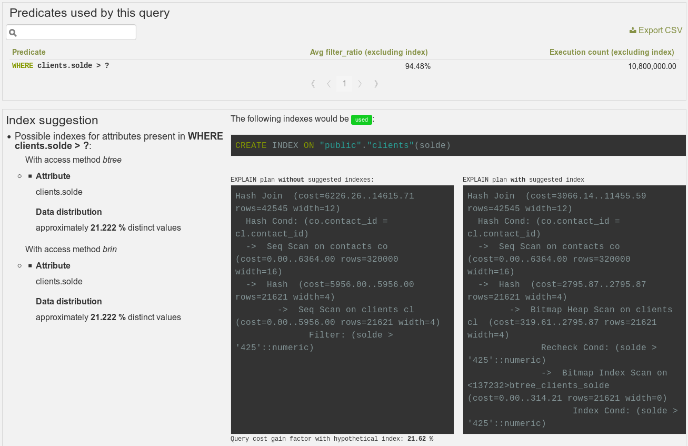
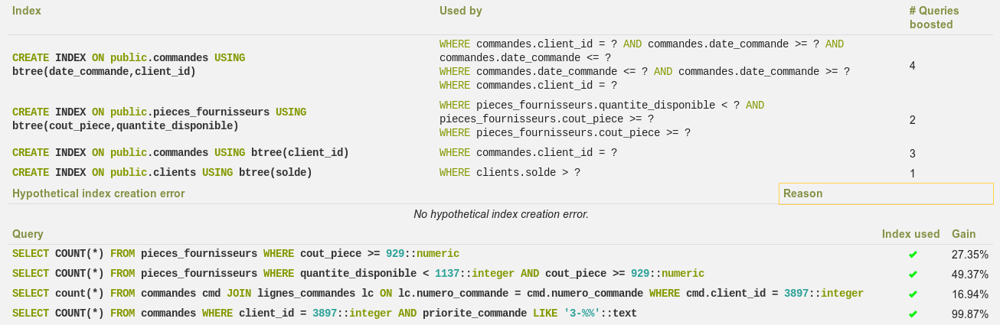

.. _hypopg: https://github.com/HypoPG/hypopg/

.. _hypopg_doc:

HypoPG
======

HypoPG is a stat extension, but it's a useful extension to take full advantage
of all the PoWA features.

HypoPG allows you to create hypothetical indexe. A hypothetical index is an
index that doesn't exists on disk. It's therefore almost instant to create and
doesn't add any IO cost, whether at creation time or at maintenance time. The
goal is obviously to check if an index is useful before spending too much time,
I/O and disk space to create it.

With this extension, you can create hypothetical indexes, and then with EXPLAIN
check if PostgreSQL would use them or not.

Where is it used in powa-web ?
******************************

If :ref:`pg_qualstats` is configured, PoWA will be able to detect missing
indexes, either per-query or for the **whole workkload of a database**!

When PoWA shows suggestion of missing indexes, if HypoPG is available **on the
target database** (of the **remote server** if the :ref:`remote_setup` mode is
used), it'll also try to create a hypothetical index for each suggested index,
and show you if PostgreSQL would use it or not.

This can be seen on the per-query page, in the **Predicates** tab:

And on the database page, if you use the "Optimize this database" feature:

Installation
************

As seen in :ref:`quickstart`, the PostgreSQL development packages should be
available.

First, you need to download and extract the lastest release of hypopg_.

.. parsed-literal::

  wget |hypopg_download_link| -O hypopg-|hypopg_release|.tar.gz
  tar zxvf hypopg-|hypopg_release|.tar.gz
  cd hypopg-|hypopg_release|

Then, compile the extension:

.. code-block:: bash

  make

Then install the compiled file. This step has to be made with the user that has
installed PostgreSQL. If you have used a package, it will be certainly be root.
If so:

.. code-block:: bash

  sudo make install

Else, sudo into the user that owns your PostgreSQL executables, and

.. code-block:: bash

  make install

No specific configuration or PostgreSQL restart is needed.

Connect as a superuser on each database of each server you want to be able to
use hypopg_ on, and type:

.. code-block:: sql

  CREATE EXTENSION hypopg ;

See Also
********

    * :ref:`pg_qualstats`
    * `Official documentation <https://hypopg.readthedocs.io>`_
