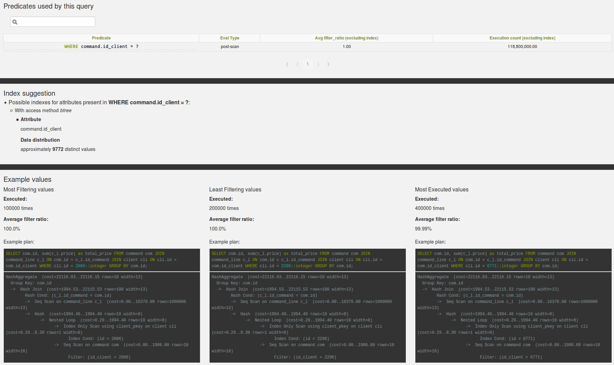

.. _pg_qualstats:

pg_qualstats
============

pg_qualstats is a PostgreSQL extension keeping statistics on predicates found
in ```WHERE``` statements and ```JOIN``` clauses.

The goal of this extension is to allow the DBA to answer to some specific questions, whose answers are quite hard to come by:

    * what is the set of queries using this column ?
    * what are the values this where clause is most often using ?
    * do I have some significant skew in the distribution of the number of returned rows if use some value instead of one another ?
    * which columns are often used together in a WHERE clause ?

Where is it used in powa-web ?
******************************

If the extension is available, you should see a "list of quals" table on the
query page, as well as explain plans for your query and a list of index
suggestions:



From this list, you can then go on to the per-qual page.


Installation
************

Configuration
*************

Examples
********

See Also
********
