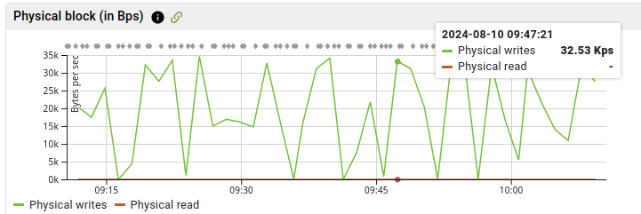
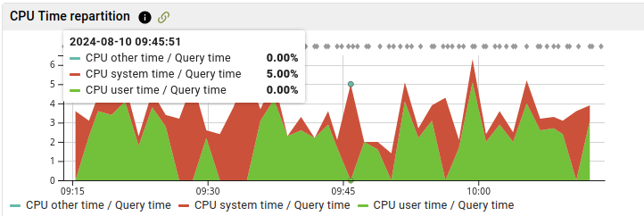

.. _pg_stat_kcache: https://github.com/powa-team/pg_stat_kcache

.. _pg_stat_kcache_doc:

pg_stat_kcache
==============

pg_stat_kcache_ is a PostgreSQL extension gathering statistics on system
metrics.

Thanks to this extension, the DBA can see how much resource each query, user
and/or database is consuming. The resources are:

    * CPU (user time and system time)
    * Physical disk access (read and write)

Physical disk access are essential in calculating a real hit ratio (cached_reads/all_reads). Without this, we only have the shared_buffers' hit ratio, and some of the reads made by Postgres could be served by the system cache.

Where is it used in powa-web ?
******************************

If the extension is available, you should see "Physical block" and "CPU time"
graphs on the query page:

The **CPU time** metrics indicate the percentage of query runtime spent consuming
either *user cpu time* or *system cpu time*.

The "Hit ratio" graph will also handle this extension, displaying the following
metrics :

    * **Shared buffers hit ratio**: percentage of blocks read from shared buffers (memory)
    * **System cache hit ratio**: precentage of blocks read from the system cache (memory)
    * **Disk hit ratio**: Percentage of blocks which needed a physical disk read

Installation
************

pg_stat_kcache_ should work with any POSIX operating system. Therefore, it
won't on Windows.

As seen in :ref:`quickstart`, the PostgreSQL development packages should be
available.

First, you need to download and extract the lastest release of pg_stat_kcache_.

.. parsed-literal::

  wget |pg_stat_kcache_download| -O pg_stat_kcache-|pg_stat_kcache_release|.tar.gz
  tar zxvf pg_stat_kcache-|pg_stat_kcache_release|.tar.gz
  cd pg_stat_kcache-|pg_stat_kcache_release|

Then, compile the extension:

.. code-block:: bash

  make

If everything goes fine, you will have this kind of output :

.. code-block:: bash

  gcc -O0 -Wall -Wmissing-prototypes -Wpointer-arith -Wdeclaration-after-statement -Wendif-labels -Wmissing-format-attribute -Wformat-security -fno-strict-aliasing -fwrapv -fexcess-precision=standard -g -fpic -I. -I./ -I/home/rjuju/postgres/pgs/postgresql-9.4.beta2/include/server -I/home/rjuju/postgres/pgs/postgresql-9.4.beta2/include/internal -D_GNU_SOURCE -I/usr/include/libxml2   -c -o pg_stat_kcache.o pg_stat_kcache.c
  gcc -O0 -Wall -Wmissing-prototypes -Wpointer-arith -Wdeclaration-after-statement -Wendif-labels -Wmissing-format-attribute -Wformat-security -fno-strict-aliasing -fwrapv -fexcess-precision=standard -g -fpic -shared -o pg_stat_kcache.so pg_stat_kcache.o -L/home/rjuju/postgres/pgs/postgresql-9.4.beta2/lib -L/usr/lib/x86_64-linux-gnu  -Wl,--as-needed -Wl,-rpath,'/home/rjuju/postgres/pgs/postgresql-9.4.beta2/lib',--enable-new-dtags

Then install the compiled file. This step has to be made with the user that has
installed PostgreSQL. If you have used a package, it will be certainly be root.
If so:

.. code-block:: bash

  sudo make install

Else, sudo into the user that owns your PostgreSQL executables, and

.. code-block:: bash

  make install

Then you just have to declare the extension in the ``postgresql.conf`` file, like this :

.. code-block:: ini

  shared_preload_libraries = 'pg_stat_statements,pg_stat_kcache'

Restart the PostgreSQL server to reload the libraries.

Connect to the server as a superuser and type:

.. code-block:: sql

  CREATE EXTENSION pg_stat_kcache ;

Using with PoWA
***************

If you want PoWA to handle this extension, you have to connect as a superuser
on the database where you installed PoWA, and type:

.. code-block:: sql

  SELECT powa_kcache_register();

Configuration
*************

pg_stat_kcache_ will retain as many query statistic as pg_stat_statements, so
there's nothing to configure.

Examples
********

See Also
********

    * :ref:`pg_stat_statements_doc`
    * :ref:`pg_qualstats`
