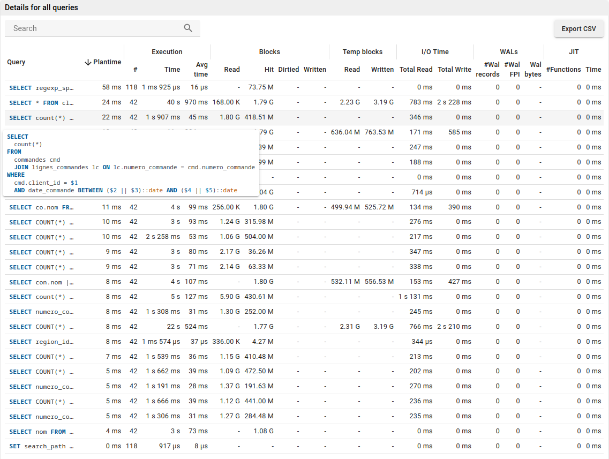
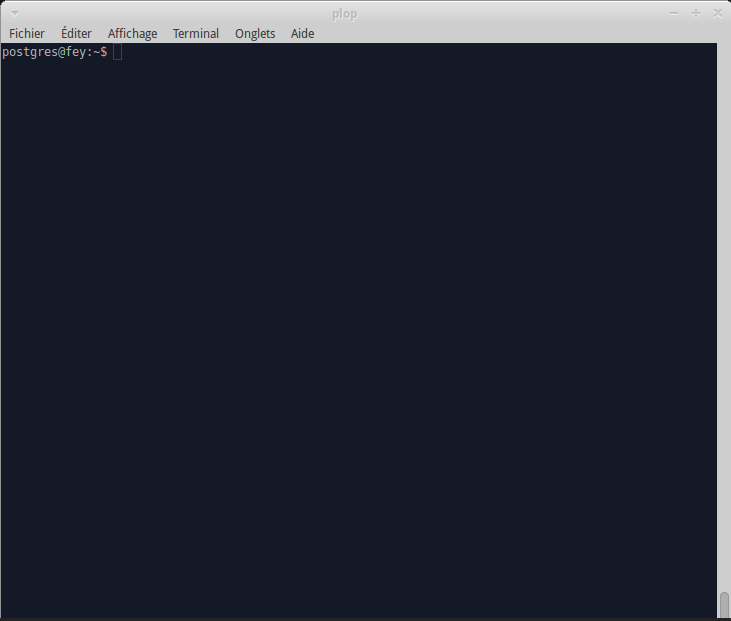

.. _pg_stat_statements: http://www.postgresql.org/docs/current/static/pgstatstatements.html

.. _pg_stat_statements_doc:

pg_stat_statements
==================

The pg_stat_statements_ extension records statistics of all SQL queries (aka
"statements")  executed on a given PostgreSQL server.

The statistics gathered are available in view called ``pg_stat_statements``.
This view contains one row for each distinct database ID, user ID and query ID.
However the number of distinct statements tracked cannot exceed a certain limit
(5 000 by default)

The pg_stat_statements_ extension is a key component of the PoWA Suite,
installing it is **mandatory**.

Where is it used in powa-web ?
******************************

The PoWA user interface (``powa-web``) relies heavily on pg_stat_statements_,
so you'll see it used in almost every screen of the tool.

The most useful feature is probably the "Query details" chart which show
advanced statistics for each SQL query.

Installation
************

pg_stat_statements_ is an official extension and it is released along with
other extensions in the official PostgreSQL packages.
You will find it in the ``contrib`` folder. Depending on which Operating
System, you're using you may need to install a separate package to use it. For
instance, on ``debian`` you may need to install the ``postgresql-contrib``
package.

Then you just have to declare the extension in the ``postgresql.conf`` file,
like this :

``shared_preload_libraries = 'pg_stat_statements'``

Restart the PostgreSQL server to reload the libraries.

Connect to the server as a superuser and type:

``CREATE EXTENSION pg_stat_statements``

Configuration
*************

There's a few parameters that you can add to the ``postgresql.conf``. For
instance you can increase the track limit and allow PostgreSQL to record 10 000
distinct queries:

``pg_stat_statements.max = 10000``

For more information about the pg_stat_statements_, please read the PostgreSQL
documentation:

http://www.postgresql.org/docs/current/static/pgstatstatements.html

Examples
********

See Also
********

* http://www.craigkerstiens.com/2013/01/10/more-on-postgres-performance/

